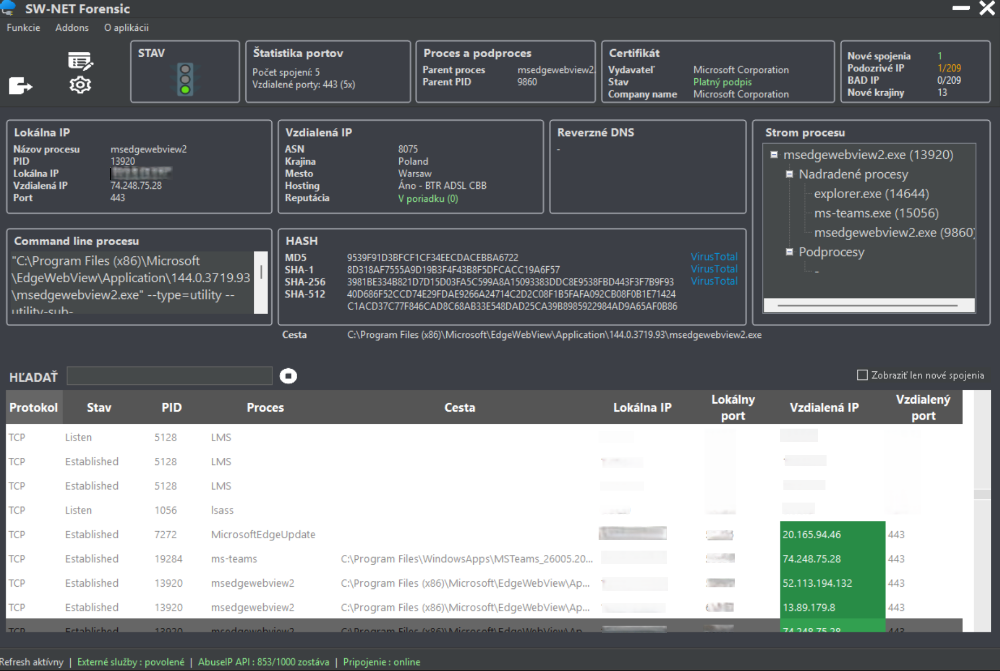

# SW-NET Forensic

Advanced network and process monitoring tool for Windows. Features real-time TCP/UDP tracking, VirusTotal integration, and IP reputation checks.

> ⚠️ **Note for international users:** Version 1.0.0 is currently available in the **Slovak (SK)** language only. Full English (EN) localization is already in development and will be released in the upcoming **v1.1.0**. Feel free to star the repository to stay updated!

## ✨ Key Features (Slovak Version)

* **Real-time Monitoring:** Monitor active TCP/UDP connections and listening ports.
* **Process Correlation:** Instantly link network activity to specific Processes (PID), Parent Processes, and file paths.
* **IP Reputation:** Built-in AbuseIPDB check for rapid detection of suspicious remote IPs.
* **Certificate Validation:** Verify digital signatures and publishers of communicating apps.
* **Reverse DNS & Fast Hash:** One-click reverse DNS lookup and MD5/SHA hash generation.

## 🔒 Security & Integrity (Checksums)

To ensure you have the authentic build, please verify the SHA-256 hashes of the files you download:

* **SW-NET-Forensic.zip:** `05d2672fb81c83dce2d47ed36af4a49a442eb21d0133cd593903248bab22c399`
* **SW-NET-Forensic.exe:** `8ff6fbb2abadff759f94520613329b9de3f4148ba4f676160692627270c7622a`

> **🛡️ Note on VirusTotal / False Positives:** As a newly compiled, unsigned .NET freeware application, some minor heuristic scanners (1/67 on VT) may flag the executable as suspicious (`MSIL_Heur`). This is a known false positive. The software is 100% clean, verified by all major security vendors (Microsoft Defender, ESET, BitDefender, Avast), and passed behavioral analysis via Hybrid Analysis.

## 💬 Community & Support

Have questions, bug reports, or feature requests? Use the **Issues** tab to start a discussion. If you'd like your nickname included in our future **Hall of Fame** inside the application, don't hesitate to reach out!
