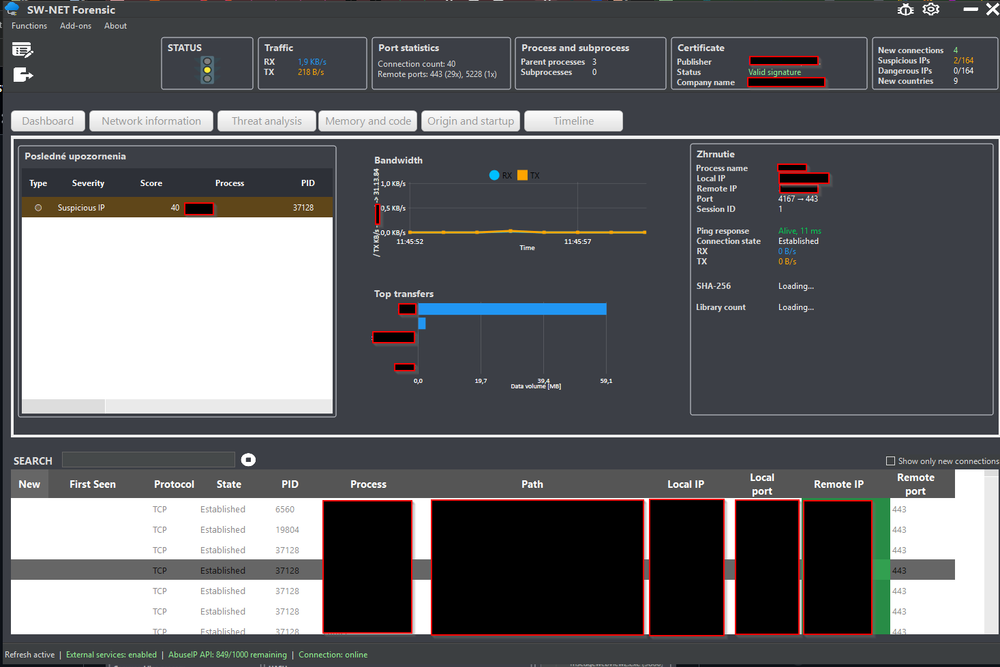

# SW-NET Forensic

Advanced network and process monitoring tool for Windows. Features real-time TCP/UDP tracking, VirusTotal integration, and IP reputation checks.

> ✅ **Note for international users:** Full **English (EN)** language support is now available in **v1.1.0** – switch between Slovak (SK) and English anytime. See "What's New" below!

## ✨ Key Features (Slovak Version)

* **Real-time Monitoring:** Monitor active TCP/UDP connections and listening ports.
* **Process Correlation:** Instantly link network activity to specific Processes (PID), Parent Processes, and file paths.
* **IP Reputation:** Built-in AbuseIPDB check for rapid detection of suspicious remote IPs.
* **Certificate Validation:** Verify digital signatures and publishers of communicating apps.
* **Reverse DNS & Fast Hash:** One-click reverse DNS lookup and MD5/SHA hash generation.

## 🆕 What's New in v1.1.0

**🇬🇧 English language support** – Full English localization is now available. Switch between Slovak (SK) and English (EN) anytime.

**📊 Network connection charts** – See real-time RX/TX traffic for any connection + Top 5 processes by network usage.

**🔍 One-click connection details** – WHOIS, RDAP, ping, traceroute, DNS, reverse DNS, and TLS certificates.

**🧠 Process forensics** – View loaded libraries, SHA-256 hash, file metadata, and process tree for any running process.

**🔎 Memory string scanner** – Search ASCII/Unicode text in process memory (hidden commands, URLs, etc.).

**🛡️ Threat intelligence panels** – VirusTotal, Hybrid Analysis, GreyNoise, plus a dedicated alerts table.

**🛡️ Anti-BSOD protection** – Risk assessment before killing a process. Dangerous system processes are blocked or require confirmation.

**🔐 Encrypted API keys** – Your API keys are now stored encrypted, not as plain text.

## 🔧 Improvements in v1.1.0

- Better IP filtering (ignores private, CGNAT, multicast, and reserved ranges)
- Clean application shutdown – no hanging processes
- Update checker now reads actual software version (no false notifications)
- API response caching – faster loading, fewer API calls
- Better retry and timeout handling for cloud services

## 🔒 Security & Integrity (Checksums)

To ensure you have the authentic build, please verify the SHA-256 hashes of the files you download:

* **SW-NET-Forensic.zip:** `sha256:fdb50a28e1438aae135bdf0701da200ce9199ba2489b7fa868311317b5169d96`
* **SW-NET-Forensic.exe:** `f19936ebc8c9d9414c346436eb2ed37480c403d18a198a969664c08279b0b3ec`

> **🛡️ Note on VirusTotal / False Positives:** As a newly compiled, unsigned .NET freeware application, some minor heuristic scanners (1/67 on VT) may flag the executable as suspicious (`MSIL_Heur`). This is a known false positive. The software is 100% clean, verified by all major security vendors (Microsoft Defender, ESET, BitDefender, Avast), and passed behavioral analysis via Hybrid Analysis.

## 💬 Community & Support

Have questions, bug reports, or feature requests? Use the **Issues** tab to start a discussion. If you'd like your nickname included in our future **Hall of Fame** inside the application, don't hesitate to reach out!

⭐ If you find this tool useful, please consider giving it a star on GitHub!
