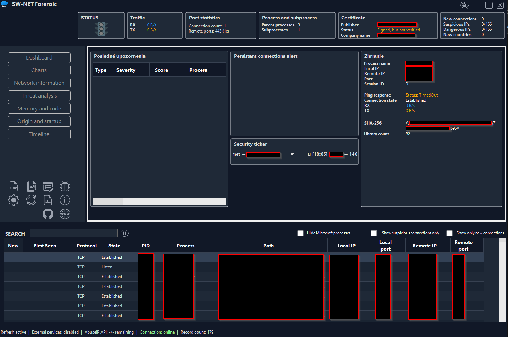
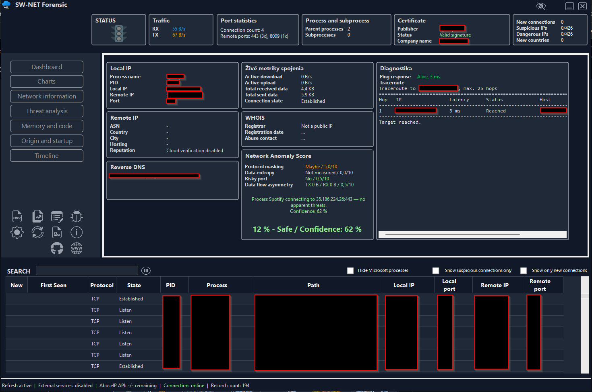
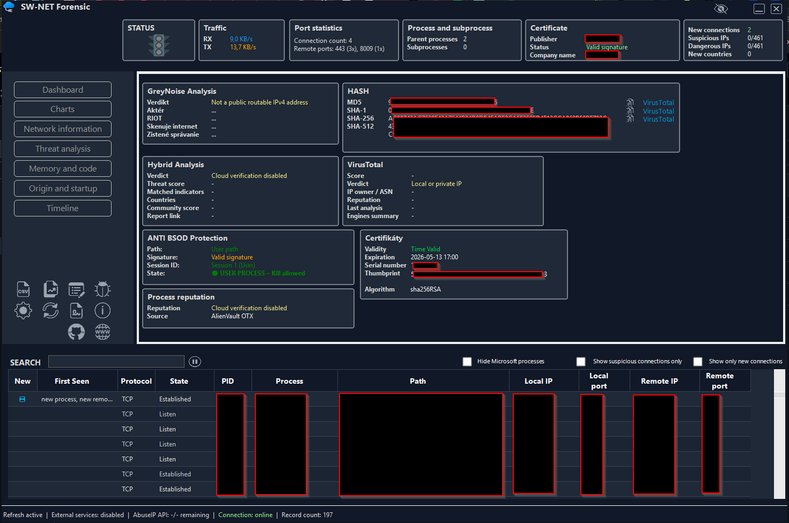
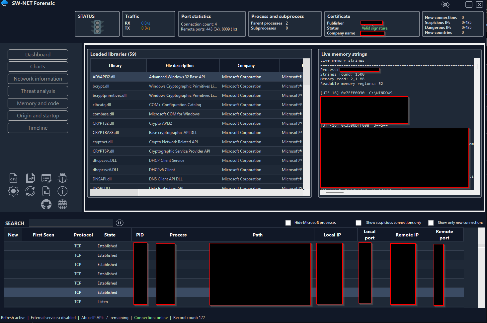

# SW-NET Forensic

Advanced network and process monitoring tool for Windows. Designed for system administrators, forensic analysts, and power users. It features real-time TCP/UDP tracking, AI-driven anomaly scoring, global GeoIP mapping, and deep process inspection.

## Quick Start

1. Download the latest release.
2. Extract `SW-NET-Forensic.zip`.
3. Run `SW-NET-Forensic.exe` as Administrator.
   * *Note: If a prompt appears asking to install the .NET Desktop Runtime, proceed with the installation. It is an official and secure framework directly from Microsoft required to run the application.*
4. Optional: Add API keys for VirusTotal, AlienVault OTX, Hybrid Analysis, and AbuseIPDB.
5. Verify SHA-256 hashes before running.

## System Requirements

- Windows 10 / Windows 11
- 64-bit system recommended
- Administrator privileges recommended for full process and network inspection
- Internet connection required for external reputation checks
- Optional API keys: VirusTotal, AlienVault OTX, Hybrid Analysis, AbuseIPDB

> 🌍 **Native Bilingual Support:** Full **English (EN)** and **Slovak (SK)** localization included. Switch languages instantly within the app.

## ✨ Why Use SW-NET Forensic? (v2.0.0 Highlights)

* **Interactive GeoIP Network Map:** Visualize your network traffic on a live global map to see exactly where your PC is communicating.
* **Network Anomaly Scoring:** Instantly identify dangerous connections. The built-in scoring system evaluates and tags processes as normal, suspicious, or high-risk.
* **Deep Process Forensics:** View loaded libraries, memory strings (ASCII/Unicode), file metadata, process privileges, and the full execution tree.
* **Command-Line Inspector:** Uncover stealthy attacks by automatically highlighting suspicious arguments in cmd, PowerShell, and script executions.
* **Eradicate Malware Chains (Kill with Parent):** Terminate a malicious process along with its entire parent tree in a single click.
* **Global Threat Intelligence:** Instantly verify suspicious activity via built-in API integrations for **AlienVault OTX, VirusTotal, Hybrid Analysis,** and **AbuseIPDB**.
* **Anti-BSOD Protection:** Built-in risk assessment blocks the termination of critical system processes or requires explicit confirmation, preventing accidental system crashes.
* **Professional Reporting:** Export your complete forensic analysis to clean PDF or HTML reports for incident response hand-offs and archiving.
* **Stealth Monitoring:** Minimize to the system tray, launch automatically on Windows startup, and receive native Windows notifications the second a risky connection is detected.

## Screenshots

### Network Overview

### Threat Analysis

### Memory & Code Inspection

## 🔒 Security & Integrity (Checksums)

To ensure you have the authentic v2.0.0 build, please verify the SHA-256 hashes of the files you download:

* **SW-NET-Forensic.zip:** `f480b2af17b4de99579fc4823fd5c9960f844a85d3478c16d86a7d35fc86298c`
* **SW-NET-Forensic.exe:** `222227f324dd8e5f2b1eaa29eec84929063230101ca138bef2e6ea579f3387a4`

## Privacy & External API Usage

SW-NET Forensic may send selected IP addresses, hashes, or indicators to third-party threat intelligence services only when the related lookup feature is used or configured. API keys are stored locally in the application settings.

## 🛡️ False Positives / Antivirus Notice

SW-NET Forensic is a newly compiled, unsigned .NET security and forensic utility. Because it inspects processes, network connections, command lines, memory-related metadata and other system-level information, some heuristic antivirus engines may flag the executable as suspicious.

This can happen with unsigned portable security tools, especially when they perform legitimate forensic or administrative actions that are also commonly monitored by security products.

To verify the release, you can:

- Compare the published SHA-256 hashes with your downloaded files.
- Scan the executable with your preferred antivirus solution.
- Review the file in a sandbox or behavior-analysis environment if required.
- Download SW-NET Forensic only from the official GitHub release page.

Known context:

- The application does not contain malware.
- External threat-intelligence lookups are used only for security analysis features.
- Any antivirus detection should be reviewed together with file hashes, behavior and source of download.

## ⚖️ License & EULA

This software is Freeware. By using SW-NET Forensic, you agree to my [End User License Agreement (EULA)](https://www.digitalnypriestor.sk/software/sw-net/eula.html).

## 💬 Community & Support

Have questions, bug reports, or feature requests? Use the **Issues** tab to start a discussion. If you'd like your nickname included in the **Hall of Fame** inside the application, don't hesitate to reach out!

⭐ **If you find this tool useful, please consider giving it a star on GitHub!**

  

